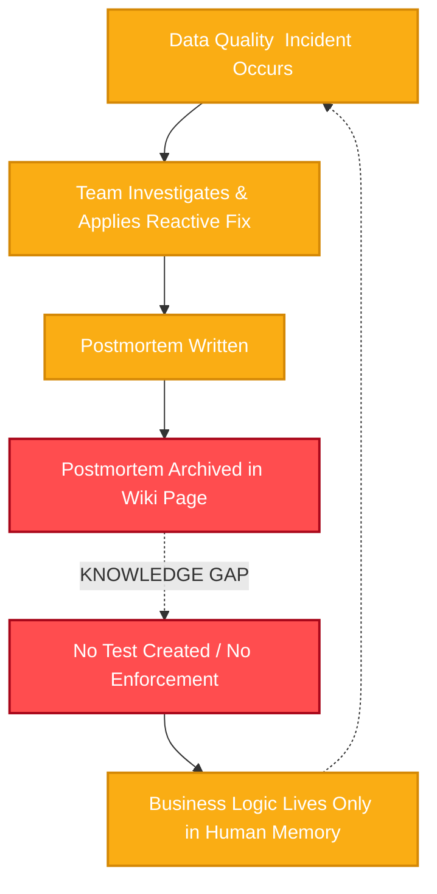
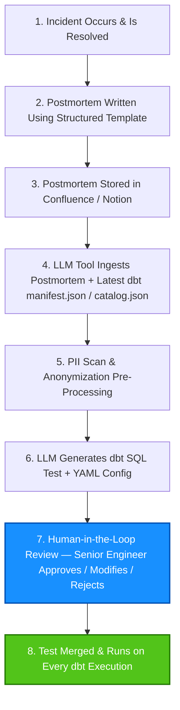
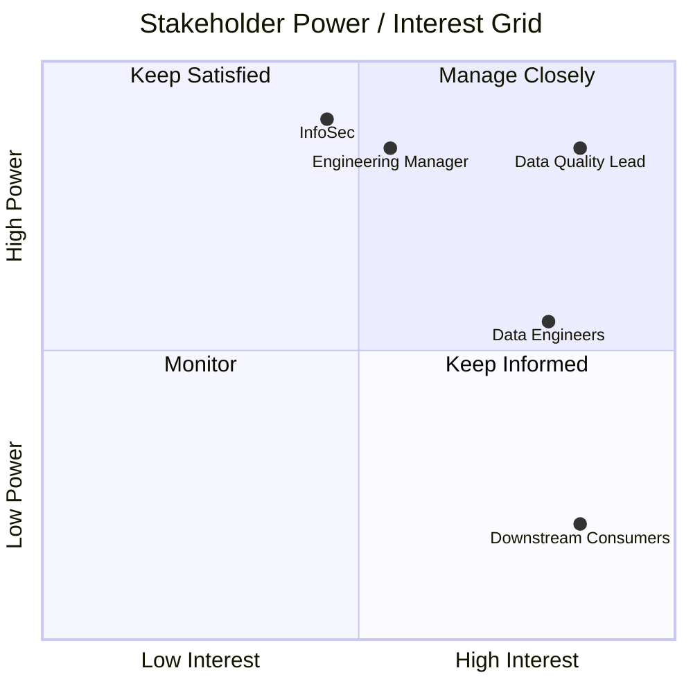

[](https://github.com/ricard-alcaraz/postmortem-dbt/)
## Executive Summary

Data engineering teams currently lose an estimated **10 hours per quarter** investigating data quality incidents that have happend in the past. These incidents get documented in postmortem analysis, but that knowledge rarely is implemented in the code to prevent future similar data incidents, as a preventive safeguard. This proposal outlines a solution that uses an LLM to automatically translate postmortem documentation into dbt tests, closing the gap between what a team *learns* from an incident and what it actually *enforces* in code.

> ### 🎯 The ROI
> **Reduces incident remediation time by 75% and increases test coverage from incidents by 3x.**

---

## 1. The Problem: Knowledge forgotten

Here's what typically happens after an incident.



Reactive fixes are prioritized over durable prevention. The postmortem which actually contains the business logic needed to prvent future incidents gets archived instead of being turned into enforced code. That's an inefficient loop: the same class of incident can happen months later, and the team has to investigate again the problem, taking a look at previous documentation, but its not encoded as a guardrail.

---

## 2. The Solution: An 8-Step Automated Workflow

The proposed process closes that loop by inserting an LLM-powered translation step between "we understand what went wrong" and "the system now prevents it from happening again."



The two steps worth calling out: **Step 5** (PII scanning) exists specifically to satisfy InfoSec before anything is sended to an external API, and **Step 7** (human-in-the-loop review) is needed, no LLM-generated test is merged without explicit validation from a senior engineer.

**Scope for v1:**
- ✅ In scope: dbt projects with SQL-based tests, postmortems written in English, Confluence/Notion as the source system
- ❌ Out of scope: non-dbt data projects, non-English postmortems, automatic PR creation (v1 generates the test; a human still opens the PR)

---

## 3. The Artifacts

<details>
<summary><strong>📊 Tab 1: Stakeholder Matrix</strong></summary>

| Stakeholder | Category | Power / Influence | Interest Level | Key Concerns & Expectations | Engagement Strategy |
|---|---|---|---|---|---|
| Data / Analytics Engineers | Primary Users (SMEs) | Medium | High | "Will this add friction to my workflow? Will the LLM generate wrong tests I have to fix?" | **Manage Closely** — involve them in early testing; integrate into their existing IDE/PR workflow |
| Head of Data / Engineering Manager | Project Sponsor | High | Medium | "What is the ROI? Will this reduce incident resolution time and improve velocity?" | **Keep Satisfied** — monthly metrics on time saved and incidents prevented, framed around business value and LLM API costs |
| Data Quality / Governance Lead | Approver | High | High | "Will this improve our Data Quality SLAs? Are we creating a sustainable, version-controlled safety net?" | **Manage Closely** — align tool output with existing data quality frameworks; use them to support the structured postmortem template |
| Downstream Data Consumers (BI Analysts, PMs) | Beneficiaries | Low | High | "I just want dashboards to stop breaking because of null timestamps or missing data." | **Keep Informed** — communicate reliability improvements; no build involvement, but they're the real beneficiaries |
| InfoSec / IT Security | Gatekeeper | High | Medium | "Are we sending proprietary schema details, table names, or sample data to an external LLM API?" | **Keep Satisfied** — proactively address via an enterprise-grade, private LLM instance or anonymized schema metadata |

**Power/Interest Grid**



- **High Power, High Interest — Manage Closely:** Data Quality Lead, Engineering Manager. These are the decision-makers its needed to engage them weekly.
- **High Power, Low Interest — Keep Satisfied:** InfoSec, Head of Data. They can block the project but don't need the details, give them high-level summaries and compliance assurances.
- **Low Power, High Interest — Keep Informed:** Downstream Data Consumers. They love the outcome but can't build it send release notes about "improved data reliability."
- **Low Power, Low Interest — Monitor:** External vendors or unrelated teams. Minimal effort required.

</details>

<details>
<summary><strong>🔍 Tab 2: Gap Analysis & Risk Register</strong></summary>

### Gap Analysis

| Gap Category | Description | Impact |
|---|---|---|
| **Process Gap** | No standardized, enforced step in the incident resolution workflow requires the creation of a preventive test. | Postmortems remain passive documents; recurring incidents keep draining engineering resources. |
| **Technology Gap** | No existing tooling bridges unstructured text (postmortem analysis) and structured code (dbt SQL/YAML tests). | Engineers must manually translate business logic from text into code time-consuming and easy to skip. |
| **People / Knowledge Gap** | Engineering bandwidth is prioritized for new features over "technical debt" like test writing; knowledge lives in the author's head or a wiki, not in version control. | High risk of knowledge loss if the original engineer leaves; data quality depends on human memory rather than automated guardrails. |

### Recommendations & Action Plan

| Gap to Close | Recommended Action | Owner | Priority |
|---|---|---|---|
| Process Gap | Update the Incident Response SOP to make "Preventive Test Generation" a mandatory exit criterion for P1/P2 incidents. | Data Engineering Manager | High |
| Technology Gap | Build and deploy the LLM-based prototype that parses wiki pages and outputs dbt test files, piloted with 2–3 engineers. | Data Platform Team | High |
| Knowledge Gap | Implement a standardized Postmortem Template with required fields: Root Cause, Affected dbt Model(s), Expected Data State. | Data Quality Lead | Medium |
| Risk Mitigation | Establish a Human-in-the-Loop review step no LLM-generated test merges without senior engineer approval. | All Data Engineers | High |

### Risk Register

| Risk | Likelihood | Impact | Mitigation |
|---|---|---|---|
| LLM hallucination generates incorrect test logic | High | High | Mandatory human review before merge (Step 7 in To-Be process) |
| LLM lacks current project context | Medium | High | Tool ingests the latest `manifest.json` and `catalog.json` on each run |
| Poor-quality postmortem input | Medium | Medium | Enforce a structured postmortem template with required fields |
| LLM API costs at scale | Low | Low | Batch processing; cache repeated patterns |
| PII leakage | Low | High | Pre-processing step scans and hides PII before it's sent to the LLM |

### Success Metrics
- **Adoption:** 80% of P1/P2 postmortems result in a newly merged dbt test within 30 days of the incident.
- **Quality:** 50% reduction in recurring incidents of the same root cause over 6 months.
- **Efficiency:** Average time to create a preventive test drops from ~45 minutes (manual) to ~10 minutes (LLM-assisted + review).

</details>

<details>
<summary><strong>💻 Tab 3: User Stories & Real-World Validation</strong></summary>

### User Stories

**US-1:** As a data engineer, I want the tool to read my postmortem analysis and generate a dbt test automatically, so that I don't have to manually write the test after fixing the incident.
- *Given* a postmortem with a clearly described root cause and affected model
- *When* the tool processes the postmortem
- *Then* it generates a valid dbt SQL test file and corresponding YAML configuration
- *And* the test passes `dbt parse` without syntax errors

**US-2:** As a data quality lead, I want to review and approve all LLM-generated tests before they are merged, so that I can prevent false positives from entering the test suite.
- *Given* a generated test
- *When* the engineer reviews it
- *Then* they can approve, modify, or reject the test
- *And* rejected tests are logged for LLM improvement feedback

### Non-Functional Requirements
- **Performance:** The LLM must ingest the postmortem and generate the test file in under 30 seconds.
- **Security/Compliance:** Must use an enterprise LLM (e.g., Azure OpenAI) with zero data retention, or run a PII scanner before any text is sent to the API.
- **Usability:** Generated YAML and SQL must be properly formatted and indented per standard dbt linting rules.

### Real-World Validation

**Incident:** Orders with `status = 'shipped'` were missing the `shipped_at` timestamp, causing logistics confusion.

**Generated Test:** A custom SQL test flagging any order where `status = 'shipped'` but `shipped_at IS NULL`.

```sql
-- test: assert_shipped_orders_have_timestamp
SELECT order_id
FROM {{ ref('orders') }}
WHERE status = 'shipped'
  AND shipped_at IS NULL
```

**Impact:** This test now runs on every dbt execution, catching the issue before it reaches stakeholders.

### Business Value & ROI

| Category | Current State (Baseline) | Future State (Target) | Estimated Impact |
|---|---|---|---|
| Time Savings | ~4–6 hours per recurring incident (re-investigation + fix) | ~1 hour (postmortem only, test auto-generated) | ~75% reduction in incident remediation time |
| Quality Improvement | ~30% of postmortems result in preventive tests (estimated) | ~90% of postmortems result in preventive tests | 3x increase in test coverage from incidents |
| Knowledge Retention | Postmortems archived, rarely revisited | Knowledge operationalized as code | Permanent retention via version-controlled tests |
| Stakeholder Confidence | Recurring incidents erode trust | Fewer recurring incidents | Improved data quality SLA compliance |

</details>

---

## 4. Conclusion & Next Steps

This tool exists to help data and analytics engineers improve data quality by making it easier to implement prevention tests. It bridges the gap between knowledge that's already been documented and the implementations or improvements that should follow from it. It isn't meant to replace human judgment it's meant to make sure lessons learned from incidents actually turn into prevention, not just documentation.

As data teams mature, the focus shifts from reactive incident response to proactive quality assurance. Tools that operationalize incident knowledge are a step in that direction.

---

## 5. BA Reflection

- **Managing stakeholder expectations around AI hallucination is just as important as the technical implementation.** InfoSec and the Data Quality Lead weren't worried about whether the LLM *could* generate a test they were worried about what happens when it generates a *wrong* one. Designing the Human-in-the-Loop step wasn't a technical afterthought; it was the thing that got the project approved.
- **A gap analysis is only useful if it separates process, technology, and people.** It would have been easy to frame this as "we need better tooling," but the real blocker was partly organizational: engineering bandwidth is structurally prioritized toward features over test debt. No tool fixes that on its own the SOP change had to be part of the recommendation.
- **The most convincing artifact wasn't the diagram, it was the SQL.** Talking about "closing the knowledge-to-code gap" is abstract. Showing the actual `shipped_at IS NULL` test generated from a real incident made the value concrete for engineers and tech leads in a way that no process map could.

## 🔗 Links & Resources

- 💻 **Source Code:** [View this project on GitHub](https://github.com/ricard-alcaraz/postmortem-dbt/)
